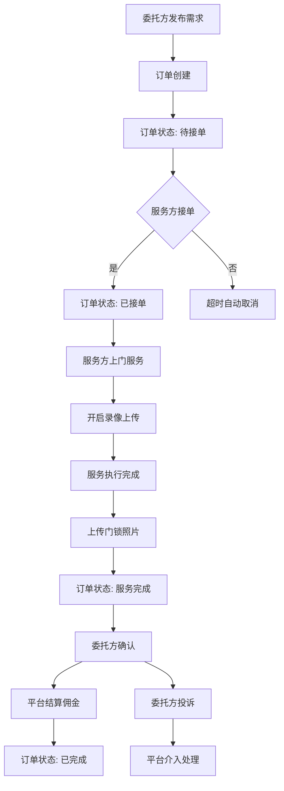
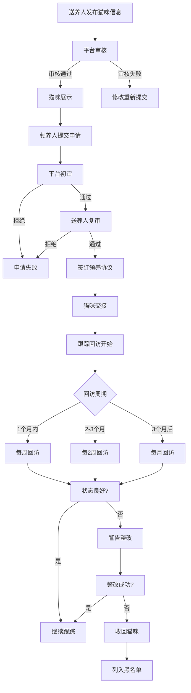
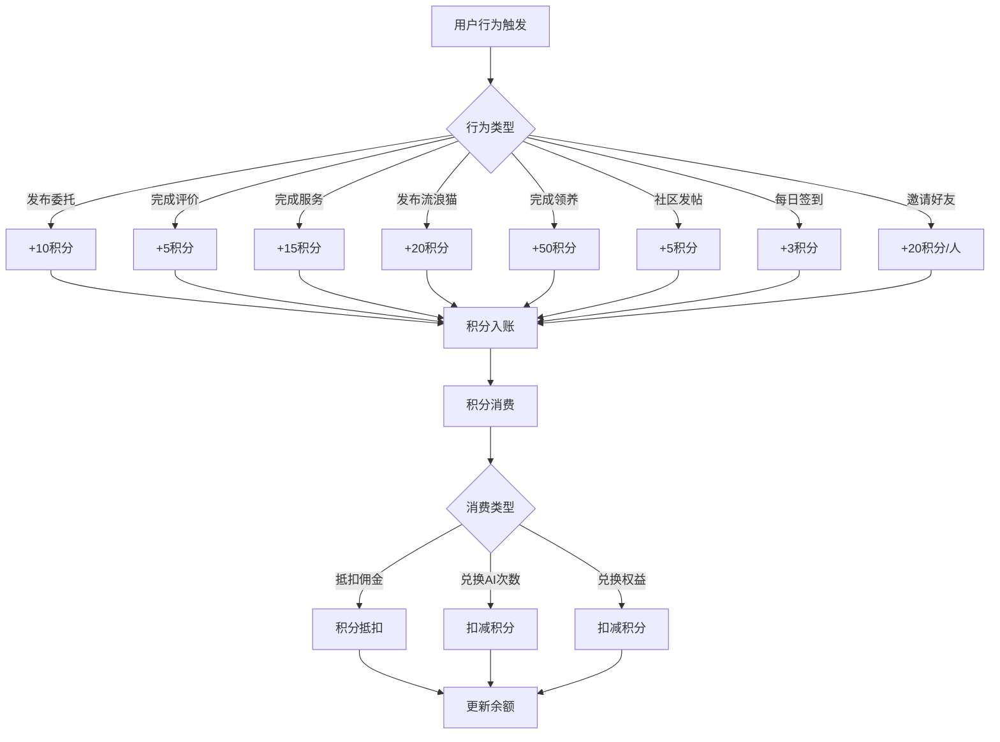

# 喵伴守护小程序后端技术方案

## 1. 需求分析

### 1.1 业务定位
以"猫咪关怀全场景服务"为核心，聚焦**上门喂猫供需撮合**与**流浪猫领养**两大核心业务，联动社区互动、AI娱乐、积分体系等辅助功能。

### 1.2 核心业务模块

| 模块 | 核心功能 | 主要角色 |
|-----|---------|---------|
| **上门喂猫服务** | 委托发布、服务方匹配、订单管理、录像监控、佣金结算 | 喵居托付官（委托方）、喵星守护使（服务方） |
| **流浪猫领养服务** | 流浪猫信息发布、领养申请、资质审核、全程跟踪、TNR申请 | 送养人、领养人 |
| **社区互动** | 帖子发布、点赞评论、任务协助 | 所有用户 |
| **AI娱乐** | 头像生成、语录生成、饲养建议 | 所有用户 |
| **积分体系** | 积分获取、积分消费、会员管理 | 所有用户 |
| **宠物档案** | 猫咪信息记录、免疫提醒、健康管理 | 委托方、领养人 |
| **合作医院** | 医院信息展示、优惠政策、预约服务 | 所有用户 |
| **商城** | 医疗团购、宠物用品销售 | 所有用户 |

### 1.3 关键业务规则

#### 1.3.1 订单取消规则
- 接单前取消：全额退款
- 接单后取消：扣除10%服务费
- 服务当天取消：扣除10%服务费

#### 1.3.2 信用分规则
- 初始分：100分
- 低于80分：限制部分功能
- 低于60分：取消资格，列入黑名单

#### 1.3.3 积分有效期
- 有效期：1年
- 不可兑现、不可转让

---

## 2. 技术选型

### 2.1 技术栈

| 分类 | 技术 | 版本 | 选型理由 |
|-----|------|-----|---------|
| 语言 | Java | 21 | LTS版本，性能稳定，生态成熟，适合企业级后端服务 |
| 框架 | Spring Boot | 3.2.x | 社区成熟，生态完善，便于快速构建RESTful服务 |
| 数据库 | MySQL | 8.0+ | 关系型数据库，事务支持完善，适合复杂业务场景 |
| ORM | Spring Data JPA + Hibernate | 6.x | 简化数据访问层开发，支持复杂查询 |
| 缓存 | Redis | 7.x | 热点数据缓存、会话管理、积分计算 |
| 消息队列 | RabbitMQ | 3.12+ | 异步任务处理、订单状态通知、录像上传 |
| 文件存储 | MinIO | 8.x | 对象存储，用于存储猫咪照片、录像文件 |
| API文档 | SpringDoc OpenAPI | 2.3.x | 自动生成API文档，便于前后端协作 |
| 认证授权 | JWT | - | 无状态认证，适合小程序场景 |

### 2.2 关键中间件

| 组件 | 用途 |
|-----|-----|
| Redis | 用户会话、验证码、热点数据缓存 |
| RabbitMQ | 录像上传异步处理、订单状态变更通知、积分计算 |
| MinIO | 存储猫咪照片、服务录像、协议文件 |

---

## 3. 架构设计

### 3.1 系统架构图

```
┌─────────────────────────────────────────────────────────────────┐
│                        前端小程序                              │
└─────────────────────────────┬───────────────────────────────────┘
                              │ HTTP/HTTPS
                              ▼
┌─────────────────────────────────────────────────────────────────┐
│                        API Gateway                             │
│              (Spring Cloud Gateway / Nginx)                    │
└─────────────────────────────┬───────────────────────────────────┘
                              │
          ┌───────────────────┼───────────────────┐
          ▼                   ▼                   ▼
┌─────────────────┐ ┌─────────────────┐ ┌─────────────────┐
│   用户服务       │ │   订单服务       │ │   领养服务       │
│ (User Service)  │ │ (Order Service) │ │ (Adopt Service) │
└─────────────────┘ └─────────────────┘ └─────────────────┘
          │                   │                   │
          ├───────────────────┼───────────────────┤
          ▼                   ▼                   ▼
┌─────────────────┐ ┌─────────────────┐ ┌─────────────────┐
│   社区服务       │ │   积分服务       │ │   AI服务         │
│ (Community)     │ │ (Points Service)│ │ (AI Service)    │
└─────────────────┘ └─────────────────┘ └─────────────────┘
          │                   │                   │
          └───────────────────┼───────────────────┘
                              │
                              ▼
┌─────────────────────────────────────────────────────────────────┐
│                        数据库层                                │
│  MySQL (业务数据) | Redis (缓存) | MinIO (文件) | RabbitMQ    │
└─────────────────────────────────────────────────────────────────┘
```

### 3.2 模块划分

| 模块 | 职责说明 |
|-----|---------|
| **user-service** | 用户注册认证、身份管理、信用体系 |
| **order-service** | 上门喂猫订单创建、服务方匹配、订单状态流转 |
| **adopt-service** | 流浪猫信息管理、领养流程、TNR申请 |
| **community-service** | 社区帖子、互动功能、任务协助 |
| **points-service** | 积分获取、积分消费、会员权益 |
| **ai-service** | AI头像生成、语录生成、饲养建议 |
| **file-service** | 文件上传、录像存储、内容分发 |

### 3.3 核心数据流

#### 3.3.1 上门喂猫订单流程
```
委托方发布需求 → 订单创建 → 服务方接单 → 服务执行（录像上传）→ 服务完成 → 订单确认 → 佣金结算
```

#### 3.3.2 领养流程
```
送养人发布猫咪信息 → 平台审核 → 领养人申请 → 联合审核 → 送养交接 → 跟踪回访
```

---

## 4. 数据库设计

### 4.1 核心数据表

#### 4.1.1 用户表 (`users`)

| 字段名 | 类型 | 约束 | 说明 |
|-------|------|-----|-----|
| id | BIGINT | PRIMARY KEY, AUTO_INCREMENT | 用户ID |
| phone | VARCHAR(20) | UNIQUE, NOT NULL | 手机号 |
| name | VARCHAR(50) | NOT NULL | 姓名 |
| id_card | VARCHAR(18) | UNIQUE | 身份证号 |
| avatar | VARCHAR(255) | - | 头像URL |
| address | VARCHAR(500) | - | 常用地址 |
| role | TINYINT | NOT NULL, DEFAULT 0 | 用户角色：0-普通用户, 1-委托方, 2-服务方, 3-送养人, 4-领养人 |
| credit_score | INT | DEFAULT 100 | 信用分 |
| status | TINYINT | NOT NULL, DEFAULT 1 | 状态：0-禁用, 1-正常 |
| created_at | DATETIME | NOT NULL | 创建时间 |
| updated_at | DATETIME | NOT NULL | 更新时间 |

#### 4.1.2 猫咪档案表 (`cat_profiles`)

| 字段名 | 类型 | 约束 | 说明 |
|-------|------|-----|-----|
| id | BIGINT | PRIMARY KEY, AUTO_INCREMENT | 猫咪ID |
| user_id | BIGINT | FOREIGN KEY | 所属用户ID |
| name | VARCHAR(50) | NOT NULL | 猫咪名字 |
| breed | VARCHAR(50) | - | 品种 |
| age | VARCHAR(20) | - | 年龄 |
| gender | TINYINT | - | 性别：0-公, 1-母 |
| health_status | TEXT | - | 健康状况 |
| dietary_habits | TEXT | - | 饮食习惯 |
| taboos | TEXT | - | 禁忌事项 |
| sterilized | TINYINT | DEFAULT 0 | 是否已绝育 |
| vaccinated | TINYINT | DEFAULT 0 | 是否已免疫 |
| avatar | VARCHAR(255) | - | 猫咪照片 |
| created_at | DATETIME | NOT NULL | 创建时间 |

#### 4.1.3 委托订单表 (`orders`)

| 字段名 | 类型 | 约束 | 说明 |
|-------|------|-----|-----|
| id | BIGINT | PRIMARY KEY, AUTO_INCREMENT | 订单ID |
| order_no | VARCHAR(32) | UNIQUE, NOT NULL | 订单编号 |
| client_id | BIGINT | FOREIGN KEY, NOT NULL | 委托方ID |
| service_id | BIGINT | FOREIGN KEY | 服务方ID |
| status | TINYINT | NOT NULL, DEFAULT 0 | 状态：0-待接单, 1-已接单, 2-服务中, 3-已完成, 4-已取消 |
| start_time | DATETIME | NOT NULL | 服务开始时间 |
| end_time | DATETIME | NOT NULL | 服务结束时间 |
| visit_frequency | TINYINT | NOT NULL | 上门频次（次/天） |
| feeding_requirements | TEXT | - | 喂养要求 |
| litter_clean_standard | VARCHAR(200) | - | 猫砂清理标准 |
| special_care | TEXT | - | 特殊照料需求 |
| entry_method | TINYINT | NOT NULL | 入户方式：0-密码, 1-钥匙寄存 |
| key_storage_info | VARCHAR(500) | - | 钥匙寄存信息 |
| emergency_contact | VARCHAR(100) | - | 紧急联系人 |
| address | VARCHAR(500) | NOT NULL | 服务地址 |
| total_amount | DECIMAL(10,2) | NOT NULL | 订单总额 |
| commission_rate | DECIMAL(5,2) | DEFAULT 0.1 | 平台佣金比例 |
| created_at | DATETIME | NOT NULL | 创建时间 |
| updated_at | DATETIME | NOT NULL | 更新时间 |

#### 4.1.4 服务记录表 (`service_records`)

| 字段名 | 类型 | 约束 | 说明 |
|-------|------|-----|-----|
| id | BIGINT | PRIMARY KEY, AUTO_INCREMENT | 记录ID |
| order_id | BIGINT | FOREIGN KEY, NOT NULL | 关联订单ID |
| service_time | DATETIME | NOT NULL | 服务时间 |
| video_url | VARCHAR(255) | NOT NULL | 录像URL |
| lock_photo_url | VARCHAR(255) | - | 门锁照片URL |
| notes | TEXT | - | 服务备注 |
| created_at | DATETIME | NOT NULL | 创建时间 |

#### 4.1.5 流浪猫信息表 (`stray_cats`)

| 字段名 | 类型 | 约束 | 说明 |
|-------|------|-----|-----|
| id | BIGINT | PRIMARY KEY, AUTO_INCREMENT | 猫咪ID |
| feeder_id | BIGINT | FOREIGN KEY, NOT NULL | 送养人ID |
| name | VARCHAR(50) | - | 猫咪名字 |
| breed | VARCHAR(50) | - | 品种 |
| age | VARCHAR(20) | - | 年龄 |
| gender | TINYINT | - | 性别 |
| health_status | TEXT | NOT NULL | 健康状况 |
| sterilized | TINYINT | DEFAULT 0 | 是否已绝育 |
| vaccinated | TINYINT | DEFAULT 0 | 是否已免疫 |
| location | VARCHAR(200) | - | 发现地点 |
| description | TEXT | - | 描述 |
| photos | TEXT | - | 照片URL（JSON数组） |
| status | TINYINT | DEFAULT 0 | 状态：0-待审核, 1-待领养, 2-已领养 |
| created_at | DATETIME | NOT NULL | 创建时间 |
| updated_at | DATETIME | NOT NULL | 更新时间 |

#### 4.1.6 领养申请表 (`adoption_applications`)

| 字段名 | 类型 | 约束 | 说明 |
|-------|------|-----|-----|
| id | BIGINT | PRIMARY KEY, AUTO_INCREMENT | 申请ID |
| cat_id | BIGINT | FOREIGN KEY, NOT NULL | 流浪猫ID |
| applicant_id | BIGINT | FOREIGN KEY, NOT NULL | 申请人ID |
| living_address | VARCHAR(500) | NOT NULL | 居住地址 |
| housing_type | TINYINT | NOT NULL | 住房类型：0-合租, 1-独立住房 |
| family_agree | TINYINT | NOT NULL | 家人是否同意 |
| pet_experience | TEXT | - | 养宠经验 |
| has_abandoned | TINYINT | DEFAULT 0 | 是否有弃养经历 |
| status | TINYINT | DEFAULT 0 | 状态：0-待初审, 1-待复审, 2-已通过, 3-已拒绝 |
| platform_note | TEXT | - | 平台审核备注 |
| feeder_note | TEXT | - | 送养人审核备注 |
| created_at | DATETIME | NOT NULL | 创建时间 |
| updated_at | DATETIME | NOT NULL | 更新时间 |

#### 4.1.7 积分记录表 (`points_records`)

| 字段名 | 类型 | 约束 | 说明 |
|-------|------|-----|-----|
| id | BIGINT | PRIMARY KEY, AUTO_INCREMENT | 记录ID |
| user_id | BIGINT | FOREIGN KEY, NOT NULL | 用户ID |
| type | TINYINT | NOT NULL | 类型：0-获取, 1-消费 |
| source | VARCHAR(50) | NOT NULL | 来源：order_publish, service_complete, adopt_complete等 |
| amount | INT | NOT NULL | 积分数量 |
| balance_before | INT | NOT NULL | 变动前余额 |
| balance_after | INT | NOT NULL | 变动后余额 |
| related_id | BIGINT | - | 关联业务ID |
| created_at | DATETIME | NOT NULL | 创建时间 |

#### 4.1.8 社区帖子表 (`community_posts`)

| 字段名 | 类型 | 约束 | 说明 |
|-------|------|-----|-----|
| id | BIGINT | PRIMARY KEY, AUTO_INCREMENT | 帖子ID |
| user_id | BIGINT | FOREIGN KEY, NOT NULL | 发布者ID |
| title | VARCHAR(200) | NOT NULL | 标题 |
| content | TEXT | NOT NULL | 内容 |
| images | TEXT | - | 图片URL（JSON数组） |
| type | TINYINT | DEFAULT 0 | 类型：0-日常分享, 1-求助, 2-闲置转让 |
| view_count | INT | DEFAULT 0 | 浏览量 |
| like_count | INT | DEFAULT 0 | 点赞数 |
| comment_count | INT | DEFAULT 0 | 评论数 |
| status | TINYINT | DEFAULT 0 | 状态：0-待审核, 1-已发布, 2-已删除 |
| created_at | DATETIME | NOT NULL | 创建时间 |

#### 4.1.9 服务方资质表 (`service_provider_credentials`)

| 字段名 | 类型 | 约束 | 说明 |
|-------|------|-----|-----|
| id | BIGINT | PRIMARY KEY, AUTO_INCREMENT | 资质ID |
| user_id | BIGINT | FOREIGN KEY, NOT NULL | 服务方ID |
| id_card_front | VARCHAR(255) | NOT NULL | 身份证正面 |
| id_card_back | VARCHAR(255) | NOT NULL | 身份证反面 |
| criminal_record | VARCHAR(255) | - | 无犯罪记录证明 |
| training_certificate | VARCHAR(255) | - | 培训证书 |
| has_signed_agreement | TINYINT | DEFAULT 0 | 是否已签署协议 |
| status | TINYINT | DEFAULT 0 | 状态：0-待审核, 1-已通过, 2-已拒绝 |
| created_at | DATETIME | NOT NULL | 创建时间 |

### 4.2 ER图结构

```
用户(users) 1:N 猫咪档案(cat_profiles)
用户(users) 1:N 委托订单(orders) [client_id]
用户(users) 1:N 委托订单(orders) [service_id]
用户(users) 1:N 流浪猫(stray_cats) [feeder_id]
用户(users) 1:N 领养申请(adoption_applications) [applicant_id]
用户(users) 1:N 积分记录(points_records)
用户(users) 1:N 社区帖子(community_posts)
用户(users) 1:1 服务方资质(service_provider_credentials)
委托订单(orders) 1:N 服务记录(service_records)
流浪猫(stray_cats) 1:N 领养申请(adoption_applications) [cat_id]
社区帖子(community_posts) 1:N 评论(comments)
社区帖子(community_posts) 1:N 点赞(likes)
```

---

## 5. API接口设计

### 5.1 认证模块

| API路径 | HTTP方法 | 功能描述 |
|--------|---------|---------|
| `/api/auth/register` | POST | 用户注册 |
| `/api/auth/login` | POST | 用户登录 |
| `/api/auth/logout` | POST | 用户退出 |
| `/api/auth/verify-phone` | POST | 手机号验证 |
| `/api/auth/verify-face` | POST | 人脸识别验证 |
| `/api/auth/refresh-token` | POST | 刷新Token |

#### 5.1.1 注册接口

**请求体:**
```json
{
  "phone": "13800138000",
  "password": "encrypted_password",
  "name": "张三",
  "idCard": "110101199001011234"
}
```

**响应体:**
```json
{
  "code": 200,
  "message": "注册成功",
  "data": {
    "userId": 1,
    "token": "jwt_token",
    "expireTime": "2024-01-01 12:00:00"
  }
}
```

### 5.2 用户模块

| API路径 | HTTP方法 | 功能描述 |
|--------|---------|---------|
| `/api/users/profile` | GET | 获取用户信息 |
| `/api/users/profile` | PUT | 更新用户信息 |
| `/api/users/cats` | GET | 获取用户猫咪列表 |
| `/api/users/cats` | POST | 添加猫咪档案 |
| `/api/users/cats/{id}` | GET | 获取猫咪详情 |
| `/api/users/cats/{id}` | PUT | 更新猫咪档案 |
| `/api/users/cats/{id}` | DELETE | 删除猫咪档案 |
| `/api/users/credit` | GET | 获取信用分 |
| `/api/users/credentials` | POST | 提交服务方资质 |
| `/api/users/credentials` | GET | 获取资质审核状态 |

### 5.3 订单模块

| API路径 | HTTP方法 | 功能描述 |
|--------|---------|---------|
| `/api/orders` | POST | 创建委托订单 |
| `/api/orders` | GET | 获取订单列表 |
| `/api/orders/{id}` | GET | 获取订单详情 |
| `/api/orders/{id}` | PUT | 更新订单 |
| `/api/orders/{id}` | DELETE | 取消订单 |
| `/api/orders/{id}/accept` | POST | 服务方接单 |
| `/api/orders/{id}/complete` | POST | 确认服务完成 |
| `/api/orders/{id}/records` | GET | 获取服务记录 |
| `/api/orders/{id}/video` | GET | 获取服务录像 |
| `/api/orders/{id}/evaluate` | POST | 评价服务 |

#### 5.3.1 创建订单接口

**请求体:**
```json
{
  "startTime": "2024-01-15 09:00:00",
  "endTime": "2024-01-20 18:00:00",
  "visitFrequency": 2,
  "feedingRequirements": "猫粮品牌：皇家，每次20g",
  "litterCleanStandard": "每日清理一次",
  "specialCare": "每日喂药一次，放在猫粮中",
  "entryMethod": 0,
  "keyStorageInfo": "门口鞋柜第一层",
  "emergencyContact": "李四 13900139000",
  "address": "北京市朝阳区xxx小区xx号楼xx室",
  "catIds": [1, 2],
  "totalAmount": 200.00
}
```

**响应体:**
```json
{
  "code": 200,
  "message": "订单创建成功",
  "data": {
    "orderId": 1,
    "orderNo": "MO202401010001",
    "status": 0,
    "createdAt": "2024-01-01 10:00:00"
  }
}
```

### 5.4 领养模块

| API路径 | HTTP方法 | 功能描述 |
|--------|---------|---------|
| `/api/adopt/cats` | GET | 获取待领养猫咪列表 |
| `/api/adopt/cats` | POST | 发布流浪猫信息 |
| `/api/adopt/cats/{id}` | GET | 获取猫咪详情 |
| `/api/adopt/cats/{id}` | PUT | 更新猫咪信息 |
| `/api/adopt/applications` | POST | 提交领养申请 |
| `/api/adopt/applications` | GET | 获取申请列表 |
| `/api/adopt/applications/{id}` | GET | 获取申请详情 |
| `/api/adopt/applications/{id}/review` | POST | 审核领养申请 |
| `/api/adopt/tracking/{id}` | POST | 提交跟踪回访记录 |
| `/api/adopt/tnr` | POST | 提交TNR申请 |
| `/api/adopt/blacklist` | GET | 查询领养黑名单 |

### 5.5 积分模块

| API路径 | HTTP方法 | 功能描述 |
|--------|---------|---------|
| `/api/points/balance` | GET | 获取积分余额 |
| `/api/points/records` | GET | 获取积分记录 |
| `/api/points/deduct` | POST | 积分抵扣 |
| `/api/points/exchange` | POST | 积分兑换 |

### 5.6 社区模块

| API路径 | HTTP方法 | 功能描述 |
|--------|---------|---------|
| `/api/community/posts` | GET | 获取帖子列表 |
| `/api/community/posts` | POST | 发布帖子 |
| `/api/community/posts/{id}` | GET | 获取帖子详情 |
| `/api/community/posts/{id}` | PUT | 更新帖子 |
| `/api/community/posts/{id}` | DELETE | 删除帖子 |
| `/api/community/posts/{id}/like` | POST | 点赞/取消点赞 |
| `/api/community/posts/{id}/comments` | GET | 获取评论列表 |
| `/api/community/posts/{id}/comments` | POST | 发表评论 |
| `/api/community/tasks` | GET | 获取协助任务列表 |
| `/api/community/tasks` | POST | 发布协助任务 |

### 5.7 AI模块

| API路径 | HTTP方法 | 功能描述 |
|--------|---------|---------|
| `/api/ai/avatar` | POST | 生成猫咪头像 |
| `/api/ai/quote` | POST | 生成猫咪语录 |
| `/api/ai/advice` | POST | 生成饲养建议 |
| `/api/ai/usage` | GET | 获取今日使用次数 |

### 5.8 医院模块

| API路径 | HTTP方法 | 功能描述 |
|--------|---------|---------|
| `/api/hospitals` | GET | 获取合作医院列表 |
| `/api/hospitals/{id}` | GET | 获取医院详情 |
| `/api/hospitals/{id}/discounts` | GET | 获取医院优惠政策 |

### 5.9 商城模块

| API路径 | HTTP方法 | 功能描述 |
|--------|---------|---------|
| `/api/mall/products` | GET | 获取商品列表 |
| `/api/mall/products/{id}` | GET | 获取商品详情 |
| `/api/mall/orders` | POST | 创建商城订单 |
| `/api/mall/orders` | GET | 获取商城订单列表 |

---

## 6. 核心业务流程

### 6.1 上门喂猫订单流程



### 6.2 领养流程



### 6.3 积分体系流程



---

## 7. 安全性与合规设计

### 7.1 身份认证

| 认证方式 | 应用场景 | 说明 |
|---------|---------|-----|
| JWT Token | API访问认证 | 无状态认证，Token有效期2小时，支持刷新 |
| 手机号+验证码 | 用户注册/登录 | 短信验证码，有效期5分钟 |
| 人脸识别 | 实名认证 | 对接第三方人脸核验服务 |

### 7.2 数据加密

| 数据类型 | 加密方式 | 说明 |
|---------|---------|-----|
| 用户密码 | BCrypt | 存储时加密，验证时比对 |
| 身份证号 | AES-256 | 敏感字段加密存储 |
| 手机号 | AES-256 | 脱敏显示（中间4位隐藏） |
| 通信传输 | HTTPS | 全站HTTPS，证书有效期内 |

### 7.3 隐私保护

| 措施 | 说明 |
|-----|-----|
| 信息隐匿 | 送养人与领养人无法直接查看对方完整信息 |
| 沟通隔离 | 平台内置沟通工具，记录留存用于纠纷处理 |
| 录像存储 | 服务录像存储30天，到期自动删除 |
| 权限控制 | 仅授权用户可访问相关数据 |

### 7.4 日志审计

| 日志类型 | 记录内容 | 保留期限 |
|---------|---------|---------|
| 操作日志 | 用户操作记录 | 90天 |
| 登录日志 | 登录时间、IP、设备 | 90天 |
| 订单日志 | 订单状态变更记录 | 1年 |
| 异常日志 | 系统异常、错误信息 | 30天 |

### 7.5 接口安全

| 措施 | 说明 |
|-----|-----|
| 请求频率限制 | 单IP每分钟最多100次请求 |
| 参数校验 | 使用Bean Validation进行参数校验 |
| SQL注入防护 | 使用JPA预编译语句 |
| XSS防护 | 前端输入过滤，后端输出转义 |
| CSRF防护 | JWT无状态认证天然防护 |

---

## 8. 部署与集成方案

### 8.1 依赖与环境

| 依赖 | GroupId | ArtifactId | 版本 |
|-----|--------|-----------|-----|
| Spring Boot Starter Web | org.springframework.boot | spring-boot-starter-web | 3.2.x |
| Spring Boot Starter Data JPA | org.springframework.boot | spring-boot-starter-data-jpa | 3.2.x |
| Spring Boot Starter Security | org.springframework.boot | spring-boot-starter-security | 3.2.x |
| MySQL Connector | com.mysql | mysql-connector-j | 8.3.x |
| Redis Starter | org.springframework.boot | spring-boot-starter-data-redis | 3.2.x |
| RabbitMQ Starter | org.springframework.boot | spring-boot-starter-amqp | 3.2.x |
| JWT | io.jsonwebtoken | jjwt | 0.12.x |
| MinIO SDK | io.minio | minio | 8.5.x |
| SpringDoc OpenAPI | org.springdoc | springdoc-openapi-starter-webmvc-ui | 2.3.x |

### 8.2 配置说明

#### 8.2.1 application.yml 关键配置

```yaml
server:
  port: 8080

spring:
  datasource:
    url: jdbc:mysql://localhost:3306/cat_guardian?useUnicode=true&characterEncoding=utf-8&serverTimezone=Asia/Shanghai
    username: admin
    password: password
    driver-class-name: com.mysql.cj.jdbc.Driver
  
  jpa:
    hibernate:
      ddl-auto: update
    show-sql: true
    properties:
      hibernate:
        format_sql: true
  
  data:
    redis:
      host: localhost
      port: 6379
      password: password
  
  rabbitmq:
    host: localhost
    port: 5672
    username: guest
    password: guest

minio:
  endpoint: http://localhost:9000
  access-key: minioadmin
  secret-key: minioadmin
  bucket-name: cat-guardian

jwt:
  secret: your-256-bit-secret-key-here
  expiration: 7200000
```

### 8.3 目录结构

```
backend/
├── src/
│   └── main/
│       ├── java/
│       │   └── com/example/catguardian/
│       │       ├── CatGuardianApplication.java
│       │       ├── config/          # 配置类
│       │       ├── controller/      # REST控制器
│       │       ├── service/         # 业务逻辑层
│       │       ├── repository/      # 数据访问层
│       │       ├── entity/          # 实体类
│       │       ├── dto/             # 数据传输对象
│       │       ├── enums/           # 枚举类
│       │       ├── exception/       # 异常处理
│       │       ├── security/        # 安全相关
│       │       └── utils/           # 工具类
│       └── resources/
│           ├── application.yml      # 应用配置
│           └── schema.sql           # 数据库初始化脚本
└── pom.xml                          # Maven依赖管理
```

---

## 9. 关键设计说明

### 9.1 录像存储策略

- **存储位置**: MinIO对象存储
- **存储结构**: `videos/{order_id}/{service_time}.mp4`
- **存储期限**: 30天，到期自动删除
- **访问控制**: 仅订单相关用户可访问

### 9.2 灵活用工平台对接

- **接口设计**: 预留RESTful接口
- **数据同步**: 服务完成后异步通知灵活用工平台
- **结算流程**: 平台→灵活用工平台→服务方

### 9.3 消息队列使用场景

| 队列名 | 用途 |
|-------|-----|
| video_upload | 录像上传完成通知 |
| order_status | 订单状态变更通知 |
| points_calculation | 积分计算任务 |
| commission_settlement | 佣金结算任务 |

---

## 10. 注意事项

1. **高并发场景**: 订单创建、服务接单等热点接口需做好限流和熔断
2. **数据一致性**: 订单状态变更、积分扣减等需使用事务保证一致性
3. **第三方依赖**: AI服务、人脸识别、支付接口等需做好降级处理
4. **日志监控**: 关键业务流程需记录完整日志，便于问题排查
5. **数据备份**: 数据库定期备份，文件存储启用版本控制

---

## 附录：接口错误码

| 错误码 | 含义 |
|-------|-----|
| 200 | 成功 |
| 400 | 请求参数错误 |
| 401 | 未认证 |
| 403 | 无权限 |
| 404 | 资源不存在 |
| 500 | 系统内部错误 |
| 1001 | 用户未认证 |
| 1002 | 信用分不足 |
| 1003 | 订单状态错误 |
| 1004 | 服务方资质未通过 |
| 1005 | 领养申请未通过 |